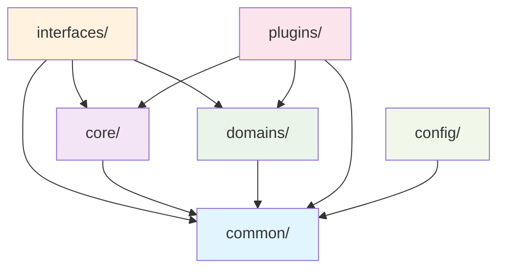

# PDFTool 架构设计与开发指南

## 📋 目录

- [项目概述](#项目概述)
- [架构设计理念](#架构设计理念)
- [领域驱动架构](#领域驱动架构)
- [设计模式与原则](#设计模式与原则)
- [目录结构说明](#目录结构说明)
- [核心组件详解](#核心组件详解)
- [扩展性设计指导](#扩展性设计指导)
- [开发最佳实践](#开发最佳实践)
- [API接口设计](#api接口设计)
- [插件系统架构](#插件系统架构)
- [配置管理](#配置管理)
- [测试策略](#测试策略)
- [部署指南](#部署指南)
- [未来演进规划](#未来演进规划)

---

## 🎯 项目概述

**PDFTool** 是一个采用现代软件架构理念构建的PDF文档处理平台，经过三个主要演进阶段：

### 演进历程
1. **单体架构** → **插件式架构** → **领域驱动架构**
2. **技术分层** → **功能分层** → **领域分层**
3. **紧耦合** → **松耦合** → **零耦合**

### 核心功能
- **文档合并**: 智能合并多个PDF文件，支持自定义排序
- **文档拆分**: 按页面、范围或书签拆分，支持批量处理
- **信息提取**: 获取完整的PDF元数据、页面统计和属性信息
- **水印处理**: 添加文本/图片水印，支持9个位置和透明度调节

### 用户接口
- **Web接口** (FastAPI): 现代化的REST API服务
- **命令行接口** (Click): 强大的CLI工具，支持所有核心功能

---

## 🏗️ 架构设计理念

### 设计哲学

PDFTool的架构设计基于以下核心理念：

#### 1. **领域驱动设计 (Domain-Driven Design)**
```
业务领域 → 代码结构 → 团队组织
```
- **按业务能力组织代码**，而非技术层次
- **领域专家和开发者共同语言**，减少沟通成本
- **聚合根和限界上下文**，清晰的业务边界

#### 2. **插件化架构 (Plugin Architecture)**
```
核心引擎 + 可插拔组件 = 无限扩展性
```
- **策略模式**：每个PDF操作都是独立的策略
- **工厂模式**：统一的操作创建和管理机制
- **注册发现**：运行时动态注册新功能

#### 3. **关注点分离 (Separation of Concerns)**
```
每个模块只关心自己的责任
```
- **单一职责**：每个类、函数都有明确的单一目的
- **接口隔离**：依赖抽象而非具体实现
- **依赖反转**：高层模块不依赖低层模块

#### 4. **SOLID原则全面应用**
- **S**ingle Responsibility: 单一职责原则
- **O**pen/Closed: 开闭原则 - 对扩展开放，对修改封闭
- **L**iskov Substitution: 里氏替换原则
- **I**nterface Segregation: 接口隔离原则
- **D**ependency Inversion: 依赖反转原则

### 架构层次图

```
┌─────────────────────────────────────────────────────────┐
│                   接口层 (Interfaces)                    │
├─────────────────────┬─────────────────┬─────────────────┤
│   Web接口 (FastAPI)  │  CLI接口 (Click) │   插件接口       │
│   • REST API        │  • 命令行工具    │   • 热加载       │
│   • Web UI          │  • 批量处理      │   • 动态注册     │
└─────────────────────┴─────────────────┴─────────────────┘
┌─────────────────────────────────────────────────────────┐
│                   应用层 (Application)                   │
├─────────────────────────────────────────────────────────┤
│  • 服务管理器 (ServiceManager)                          │
│  • 工作流编排 (Workflow Orchestration)                  │
│  • 请求验证和转换 (Request Validation & Transformation)  │
└─────────────────────────────────────────────────────────┘
┌─────────────────────────────────────────────────────────┐
│                   领域层 (Domain)                       │
├─────────────────────┬─────────────────┬─────────────────┤
│    文档域            │    安全域         │    压缩域       │
│   • 合并操作         │   • 加密解密      │   • 文件压缩    │
│   • 拆分操作         │   • 数字签名      │   • 优化处理    │
│   • 水印操作         │   • 权限控制      │   • 格式转换    │
│   • 信息提取         │                  │                │
└─────────────────────┴─────────────────┴─────────────────┘
┌─────────────────────────────────────────────────────────┐
│                   基础设施层 (Infrastructure)             │
├─────────────────────┬─────────────────┬─────────────────┤
│    核心引擎          │    公共组件       │    外部集成     │
│   • PDF处理器        │   • 异常处理      │   • 文件存储    │
│   • 操作工厂         │   • 日志记录      │   • 缓存系统    │
│   • 组件注册表       │   • 配置管理      │   • 监控告警    │
└─────────────────────┴─────────────────┴─────────────────┘
```

---

## 🌐 领域驱动架构

### 领域模型设计

#### 1. **文档处理域 (Document Domain)**
```python
# 领域聚合根
class DocumentProcessor:
    """文档处理聚合根"""

    def merge_documents(self, files: List[Document], options: MergeOptions) -> Document:
        """合并文档业务逻辑"""

    def split_document(self, document: Document, options: SplitOptions) -> List[Document]:
        """拆分文档业务逻辑"""
```

#### 2. **值对象设计 (Value Objects)**
```python
@dataclass(frozen=True)
class WatermarkPosition:
    """水印位置值对象"""
    x: float
    y: float
    alignment: WatermarkAlignment

@dataclass(frozen=True)
class PageRange:
    """页面范围值对象"""
    start: int
    end: int

    def __post_init__(self):
        if self.start > self.end:
            raise ValueError("Start page must be <= end page")
```

#### 3. **领域服务 (Domain Services)**
```python
class DocumentMergeService:
    """文档合并领域服务"""

    def merge_with_bookmarks(self, documents: List[Document]) -> Document:
        """包含书签的智能合并"""

class WatermarkService:
    """水印处理领域服务"""

    def apply_batch_watermark(self, documents: List[Document], watermark: Watermark) -> List[Document]:
        """批量应用水印"""
```

### 限界上下文 (Bounded Contexts)

```
┌─────────────────┐  ┌─────────────────┐  ┌─────────────────┐
│   文档处理上下文   │  │   安全管理上下文   │  │   存储管理上下文   │
│ Document Context │  │ Security Context │  │ Storage Context │
├─────────────────┤  ├─────────────────┤  ├─────────────────┤
│ • 文档合并       │  │ • 权限验证       │  │ • 文件存储       │
│ • 文档拆分       │  │ • 加密解密       │  │ • 缓存管理       │
│ • 水印处理       │  │ • 数字签名       │  │ • 备份恢复       │
│ • 信息提取       │  │ • 访问控制       │  │ • 清理策略       │
└─────────────────┘  └─────────────────┘  └─────────────────┘
```

---

## 🔧 设计模式与原则

### 核心设计模式

#### 1. **策略模式 (Strategy Pattern)**
```python
class IPDFOperation(ABC):
    """PDF操作策略接口"""

    @abstractmethod
    def execute(self, input_file: Path, options: Any) -> OperationResult:
        """执行策略"""

    @abstractmethod
    def validate_options(self, options: Any) -> bool:
        """验证参数"""

# 具体策略实现
class MergeOperation(BasePDFOperation):
    """合并策略实现"""

class SplitOperation(BasePDFOperation):
    """拆分策略实现"""
```

#### 2. **工厂模式 (Factory Pattern)**
```python
class PDFOperationFactory:
    """PDF操作工厂"""

    def __init__(self):
        self._operations: Dict[str, Type[IPDFOperation]] = {}
        self._register_default_operations()

    def create_operation(self, operation_type: str) -> IPDFOperation:
        """创建操作实例"""
        if operation_type not in self._operations:
            raise ValueError(f"Unknown operation: {operation_type}")
        return self._operations[operation_type]()

    def register_operation(self, name: str, operation_class: Type[IPDFOperation]):
        """注册新操作"""
        self._operations[name] = operation_class
```

#### 3. **观察者模式 (Observer Pattern)**
```python
class OperationEventManager:
    """操作事件管理器"""

    def __init__(self):
        self._observers: List[OperationObserver] = []

    def attach(self, observer: OperationObserver):
        """添加观察者"""
        self._observers.append(observer)

    def notify(self, event: OperationEvent):
        """通知所有观察者"""
        for observer in self._observers:
            observer.handle_event(event)
```

#### 4. **命令模式 (Command Pattern)**
```python
class PDFCommand(ABC):
    """PDF命令抽象基类"""

    @abstractmethod
    def execute(self) -> OperationResult:
        """执行命令"""

    @abstractmethod
    def undo(self) -> bool:
        """撤销命令"""

class MergeCommand(PDFCommand):
    """合并命令"""

    def __init__(self, files: List[Path], options: MergeOptions):
        self.files = files
        self.options = options
        self.result_file: Optional[Path] = None

    def execute(self) -> OperationResult:
        # 执行合并逻辑
        pass

    def undo(self) -> bool:
        # 撤销合并（删除结果文件）
        pass
```

### SOLID原则实践

#### 1. **单一职责原则 (SRP)**
```python
# ❌ 违反SRP - 一个类做太多事情
class PDFProcessor:
    def merge_pdfs(self): pass
    def split_pdf(self): pass
    def add_watermark(self): pass
    def validate_files(self): pass
    def log_operations(self): pass
    def send_notifications(self): pass

# ✅ 遵循SRP - 每个类只有一个职责
class PDFProcessor:
    """只负责协调PDF操作"""

class FileValidator:
    """只负责文件验证"""

class OperationLogger:
    """只负责操作日志"""

class NotificationService:
    """只负责发送通知"""
```

#### 2. **开闭原则 (OCP)**
```python
# ✅ 对扩展开放，对修改封闭
class PDFOperationFactory:
    def register_operation(self, name: str, operation_class: Type[IPDFOperation]):
        """新操作通过注册方式添加，无需修改现有代码"""
        self._operations[name] = operation_class

# 添加新功能只需要：
class CompressOperation(BasePDFOperation):
    """新的压缩操作"""

    def execute(self, input_file: Path, options: CompressOptions) -> OperationResult:
        # 实现压缩逻辑
        pass

# 注册新操作
factory.register_operation("compress", CompressOperation)
```

#### 3. **依赖反转原则 (DIP)**
```python
# ✅ 依赖抽象而非具体实现
class DocumentService:
    def __init__(self,
                 storage: IStorageService,  # 抽象存储接口
                 logger: ILogger,          # 抽象日志接口
                 validator: IValidator):   # 抽象验证接口
        self._storage = storage
        self._logger = logger
        self._validator = validator

# 具体实现可以替换
class FileStorageService(IStorageService): pass
class S3StorageService(IStorageService): pass
class DatabaseStorageService(IStorageService): pass
```

---

## 📁 目录结构说明

### 最终简洁架构

```
src/pdftool/
├── 📁 common/                    # 公共组件层 - 零依赖
│   ├── __init__.py               # 公共组件导出
│   ├── interfaces.py             # 🔌 核心接口定义
│   ├── exceptions.py             # ⚠️ 异常层次结构
│   ├── models.py                 # 📊 数据模型定义
│   └── 📁 utils/                 # 🛠️ 工具函数
│       ├── logging.py            # 📝 结构化日志
│       └── validators.py         # ✅ 输入验证
├── 📁 core/                      # 核心引擎层 - 只依赖common
│   ├── __init__.py               # 核心组件导出
│   ├── processor.py              # ⚙️ PDF处理协调器
│   ├── factory.py                # 🏭 操作工厂
│   └── registry.py               # 📋 组件注册表
├── 📁 domains/                   # 领域层 - 按业务能力组织
│   ├── __init__.py               # 领域层导出
│   ├── 📁 document/              # 📄 文档处理域
│   │   ├── __init__.py           # 文档域导出
│   │   ├── models.py             # 📊 文档领域模型
│   │   ├── validators.py         # ✅ 文档验证逻辑
│   │   └── 📁 operations/        # 🔌 文档操作实现
│   │       ├── __init__.py       # 操作导出
│   │       ├── merge.py          # 📄 智能合并操作
│   │       ├── split.py          # ✂️ 灵活拆分操作
│   │       ├── info.py           # ℹ️ 信息提取操作
│   │       └── watermark.py      # 💧 水印处理操作
│   └── 📁 future_domains/        # 🚀 未来扩展域
│       ├── compression/          # 📦 压缩处理域
│       └── security/             # 🔒 安全管理域
├── 📁 interfaces/                # 接口层 - 用户交互
│   ├── __init__.py               # 接口层导出
│   ├── 📁 web/                   # 🌐 Web接口 (FastAPI)
│   │   ├── __init__.py           # Web接口导出
│   │   ├── application.py        # 🏗️ FastAPI应用
│   │   ├── main.py               # 🚀 启动入口
│   │   ├── dependencies.py       # 🔗 依赖注入配置
│   │   ├── service_manager.py    # 👔 服务管理器
│   │   ├── 📁 handlers/          # 🎯 请求处理器
│   │   ├── 📁 routers/           # 🛣️ API路由
│   │   ├── 📁 middleware/        # 🔧 中间件组件
│   │   ├── 📁 schemas/           # 📊 请求/响应模式
│   │   └── 📁 templates/         # 🎨 Web界面模板
│   └── 📁 cli/                   # 💻 命令行接口 (Click)
│       ├── __init__.py           # CLI接口导出
│       ├── commands.py           # 📝 命令定义
│       └── main.py               # 🚀 CLI入口
├── 📁 plugins/                   # 插件系统 - 动态扩展
│   ├── __init__.py               # 插件系统导出
│   ├── base.py                   # 🔌 插件基类
│   ├── loader.py                 # 📥 插件加载器
│   └── registry.py               # 📋 插件注册表
└── 📁 config/                    # 配置管理
    ├── __init__.py               # 配置导出
    ├── settings.py               # ⚙️ 应用配置
    └── 📁 environments/          # 🌍 环境配置
        ├── development.py        # 🛠️ 开发环境
        ├── production.py         # 🚀 生产环境
        └── testing.py            # 🧪 测试环境
```

### 依赖关系图



### 模块职责说明

#### **common/ - 公共组件层**
- **职责**: 提供系统级共享组件，零外部依赖
- **包含**: 接口定义、异常类型、数据模型、工具函数
- **原则**: 纯净、稳定、可复用

#### **core/ - 核心引擎层**
- **职责**: PDF处理的核心协调逻辑
- **包含**: 处理器、工厂、注册表
- **原则**: 高效、稳定、可扩展

#### **domains/ - 领域层**
- **职责**: 按业务能力组织的领域逻辑
- **包含**: 各个业务域的操作实现
- **原则**: 业务聚合、高内聚、低耦合

#### **interfaces/ - 接口层**
- **职责**: 用户交互和外部集成
- **包含**: Web API、CLI工具
- **原则**: 用户友好、协议标准、可扩展

#### **plugins/ - 插件系统**
- **职责**: 动态扩展和插件管理
- **包含**: 插件基类、加载器、注册表
- **原则**: 热插拔、动态加载、隔离运行

---

## 🧩 核心组件详解

### 1. PDF处理器 (PDFProcessor)

```python
class PDFProcessor:
    """PDF处理协调器 - 系统的核心"""

    def __init__(self, temp_dir: Optional[Path] = None):
        self.temp_dir = temp_dir or Path("temp")
        self.operation_factory = PDFOperationFactory(temp_dir=self.temp_dir)
        self.event_manager = OperationEventManager()

    def execute_operation(self,
                         operation_type: str,
                         input_data: Any,
                         options: Any) -> OperationResult:
        """执行PDF操作的统一入口"""

        # 1. 创建操作实例
        operation = self.operation_factory.create_operation(operation_type)

        # 2. 验证参数
        if not operation.validate_options(options):
            raise PDFValidationError("Invalid operation options")

        # 3. 发送开始事件
        self.event_manager.notify(OperationStartEvent(operation_type, input_data))

        # 4. 执行操作
        try:
            result = operation.execute(input_data, options)
            self.event_manager.notify(OperationSuccessEvent(operation_type, result))
            return result
        except Exception as e:
            self.event_manager.notify(OperationErrorEvent(operation_type, e))
            raise
```

### 2. 操作工厂 (PDFOperationFactory)

```python
class PDFOperationFactory:
    """PDF操作工厂 - 负责操作的创建和管理"""

    def __init__(self, temp_dir: Optional[Path] = None):
        self.temp_dir = temp_dir or Path("temp")
        self._operations: Dict[str, Type[IPDFOperation]] = {}
        self._operation_metadata: Dict[str, OperationMetadata] = {}
        self._register_default_operations()

    def register_operation(self,
                          name: str,
                          operation_class: Type[IPDFOperation],
                          metadata: Optional[OperationMetadata] = None) -> None:
        """注册操作类"""

        # 验证操作类
        if not issubclass(operation_class, IPDFOperation):
            raise ValueError(f"Operation class must implement IPDFOperation")

        # 注册操作
        self._operations[name] = operation_class
        self._operation_metadata[name] = metadata or OperationMetadata(
            name=name,
            description=f"{name} operation",
            version="1.0.0",
            author="PDFTool",
            category="document"
        )

    def create_operation(self, operation_type: str) -> IPDFOperation:
        """创建操作实例"""
        if operation_type not in self._operations:
            raise ValueError(f"Unknown operation type: {operation_type}")

        operation_class = self._operations[operation_type]
        return operation_class(temp_dir=self.temp_dir)

    def list_operations(self) -> List[str]:
        """列出所有可用操作"""
        return list(self._operations.keys())

    def get_operation_metadata(self, operation_type: str) -> OperationMetadata:
        """获取操作元数据"""
        return self._operation_metadata.get(operation_type)
```

### 3. 服务管理器 (ServiceManager)

```python
class ServiceManager:
    """服务管理器 - Web API的核心协调器"""

    def __init__(self, pdf_processor: PDFProcessor):
        self.pdf_processor = pdf_processor
        self.service_registry = ServiceRegistry(pdf_processor)
        self.metrics_collector = MetricsCollector()

    async def handle_request(self,
                           service_name: str,
                           files: List[UploadFile],
                           request_data: BaseModel) -> OperationResult:
        """处理API请求的统一入口"""

        # 1. 获取服务处理器
        handler = self.service_registry.get_handler(service_name)

        # 2. 收集指标
        start_time = time.time()

        try:
            # 3. 处理请求
            result = await handler.handle(files, request_data)

            # 4. 记录成功指标
            self.metrics_collector.record_request(
                service_name,
                "success",
                time.time() - start_time
            )

            return result

        except Exception as e:
            # 5. 记录失败指标
            self.metrics_collector.record_request(
                service_name,
                "error",
                time.time() - start_time
            )
            raise
```

---

## 🚀 扩展性设计指导

### 扩展原则

#### 1. **零侵入扩展原则**
```python
# ✅ 正确的扩展方式 - 不修改现有代码
class CompressionOperation(BasePDFOperation):
    """新的压缩操作 - 独立实现"""

    def execute(self, input_file: Path, options: CompressionOptions) -> OperationResult:
        # 实现压缩逻辑
        pass

# 注册新操作
def register_compression_extension():
    """扩展注册函数"""
    factory = get_operation_factory()
    factory.register_operation("compress", CompressionOperation)

# ❌ 错误的扩展方式 - 修改现有代码
class PDFProcessor:
    def compress_pdf(self, ...):  # 在核心类中添加新方法
        pass
```

#### 2. **插件优先原则**
```python
# 优先使用插件机制而非直接修改
class CompressionPlugin(BasePlugin):
    """压缩功能插件"""

    @property
    def description(self) -> str:
        return "PDF compression and optimization plugin"

    def initialize(self, config: Optional[Dict[str, Any]] = None) -> None:
        """初始化插件 - 注册操作和服务"""

        # 注册操作
        factory = get_operation_factory()
        factory.register_operation("compress", CompressionOperation)
        factory.register_operation("optimize", OptimizationOperation)

        # 注册API服务
        service_registry = get_service_registry()
        service_registry.register_handler("compress", CompressionServiceHandler)

    def shutdown(self) -> None:
        """关闭插件 - 清理资源"""
        pass
```

### 扩展场景指导

#### 场景1: 添加新的PDF操作

**需求**: 添加PDF压缩功能

**实施步骤**:

1. **创建操作类**
```python
# src/pdftool/domains/compression/operations/compress.py
class CompressOperation(BasePDFOperation):
    """PDF压缩操作"""

    def execute(self, input_file: Path, options: CompressionOptions) -> OperationResult:
        """执行压缩"""

        # 1. 验证输入
        self.validate_pdf_file(input_file)

        # 2. 执行压缩逻辑
        output_file = self._perform_compression(input_file, options)

        # 3. 返回结果
        return OperationResult(
            success=True,
            output_file=output_file,
            metadata={"compression_ratio": 0.7}
        )

    def validate_options(self, options: CompressionOptions) -> bool:
        """验证压缩选项"""
        return (options.quality >= 0.1 and options.quality <= 1.0)

    def _perform_compression(self, input_file: Path, options: CompressionOptions) -> Path:
        """执行具体的压缩逻辑"""
        # 实现压缩算法
        pass
```

2. **定义数据模型**
```python
# src/pdftool/domains/compression/models.py
class CompressionOptions(BaseModel):
    """压缩选项"""
    quality: float = 0.8
    method: CompressionMethod = CompressionMethod.STANDARD
    preserve_bookmarks: bool = True
    output_filename: Optional[str] = None

class CompressionMethod(Enum):
    """压缩方法"""
    STANDARD = "standard"
    AGGRESSIVE = "aggressive"
    LOSSLESS = "lossless"
```

3. **注册操作**
```python
# src/pdftool/domains/compression/__init__.py
def register_compression_operations():
    """注册压缩操作到系统"""
    from pdftool.core.factory import get_operation_factory
    from .operations.compress import CompressOperation

    factory = get_operation_factory()
    factory.register_operation("compress", CompressOperation)
```

4. **添加API服务**
```python
# src/pdftool/interfaces/web/handlers/compress.py
class CompressionServiceHandler(BaseServiceHandler):
    """压缩服务处理器"""

    @property
    def service_name(self) -> str:
        return "compress"

    async def handle(self, files: List[UploadFile], request: CompressionRequest) -> OperationResult:
        """处理压缩请求"""

        if len(files) != 1:
            raise PDFValidationError("Compression requires exactly one file")

        # 保存文件
        input_file = await self._save_upload_file(files[0])

        try:
            # 执行压缩
            options = CompressionOptions(**request.dict())
            result = self.pdf_processor.execute_operation("compress", input_file, options)
            return result

        finally:
            # 清理临时文件
            self._cleanup_temp_file(input_file)
```

5. **添加CLI命令**
```python
# src/pdftool/interfaces/cli/commands.py
@cli.command()
@click.argument('file', type=click.Path(exists=True))
@click.option('--quality', type=float, default=0.8, help='压缩质量 (0.1-1.0)')
@click.option('--method', type=click.Choice(['standard', 'aggressive', 'lossless']),
              default='standard', help='压缩方法')
@click.option('--output', '-o', help='输出文件名', required=True)
def compress(file: str, quality: float, method: str, output: str):
    """压缩PDF文件"""
    try:
        processor = PDFProcessor()
        file_path = Path(file)

        options = CompressionOptions(
            quality=quality,
            method=CompressionMethod(method),
            output_filename=output
        )

        result = processor.execute_operation("compress", file_path, options)

        if result.success:
            click.echo(f"✅ 成功压缩到: {result.output_file}")
            if result.metadata:
                ratio = result.metadata.get("compression_ratio", 0)
                click.echo(f"📊 压缩比: {ratio:.1%}")
        else:
            click.echo(f"❌ 压缩失败: {result.error}")

    except Exception as e:
        click.echo(f"❌ 错误: {e}")
```

#### 场景2: 添加新的接口类型

**需求**: 添加GraphQL接口

**实施步骤**:

1. **创建GraphQL接口目录**
```
src/pdftool/interfaces/graphql/
├── __init__.py
├── schema.py          # GraphQL模式定义
├── resolvers.py       # 解析器
├── mutations.py       # 变更操作
└── subscriptions.py   # 订阅操作
```

2. **定义GraphQL模式**
```python
# src/pdftool/interfaces/graphql/schema.py
import graphene
from graphene_file_upload.scalars import Upload

class PDFOperationResult(graphene.ObjectType):
    """PDF操作结果"""
    success = graphene.Boolean()
    output_file_url = graphene.String()
    error_message = graphene.String()
    metadata = graphene.JSONString()

class MergePDFs(graphene.Mutation):
    """合并PDF的GraphQL变更"""

    class Arguments:
        files = graphene.List(Upload, required=True)
        output_filename = graphene.String()

    result = graphene.Field(PDFOperationResult)

    def mutate(self, info, files, output_filename=None):
        # 实现合并逻辑
        pass

class Query(graphene.ObjectType):
    """GraphQL查询"""
    available_operations = graphene.List(graphene.String)

    def resolve_available_operations(self, info):
        factory = get_operation_factory()
        return factory.list_operations()

class Mutation(graphene.ObjectType):
    """GraphQL变更"""
    merge_pdfs = MergePDFs.Field()

schema = graphene.Schema(query=Query, mutation=Mutation)
```

#### 场景3: 添加新的中间件

**需求**: 添加请求频率限制中间件

**实施步骤**:

```python
# src/pdftool/interfaces/web/middleware/rate_limiting.py
import time
from collections import defaultdict
from typing import Dict, Tuple

class RateLimitMiddleware:
    """请求频率限制中间件"""

    def __init__(self, requests_per_minute: int = 60):
        self.requests_per_minute = requests_per_minute
        self.request_history: Dict[str, List[float]] = defaultdict(list)

    async def __call__(self, request: Request, call_next):
        """中间件处理逻辑"""

        # 1. 获取客户端标识
        client_id = self._get_client_id(request)

        # 2. 检查频率限制
        if not self._check_rate_limit(client_id):
            return JSONResponse(
                status_code=429,
                content={"error": "Rate limit exceeded"}
            )

        # 3. 记录请求
        self._record_request(client_id)

        # 4. 继续处理请求
        response = await call_next(request)
        return response

    def _get_client_id(self, request: Request) -> str:
        """获取客户端标识"""
        return request.client.host

    def _check_rate_limit(self, client_id: str) -> bool:
        """检查是否超过频率限制"""
        now = time.time()
        history = self.request_history[client_id]

        # 清理过期记录
        cutoff = now - 60  # 一分钟前
        history[:] = [timestamp for timestamp in history if timestamp > cutoff]

        # 检查是否超限
        return len(history) < self.requests_per_minute

    def _record_request(self, client_id: str) -> None:
        """记录请求时间"""
        self.request_history[client_id].append(time.time())
```

### 最佳实践原则

#### 1. **接口先行原则**
```python
# 先定义接口
class ICompressionService(ABC):
    @abstractmethod
    async def compress_document(self, document: Document, options: CompressionOptions) -> CompressedDocument:
        pass

# 再实现具体类
class StandardCompressionService(ICompressionService):
    async def compress_document(self, document: Document, options: CompressionOptions) -> CompressedDocument:
        # 具体实现
        pass
```

#### 2. **配置外部化原则**
```python
# 扩展配置通过外部配置文件管理
# config/extensions.yaml
extensions:
  compression:
    enabled: true
    quality: 0.8
    methods: ["standard", "aggressive"]

  security:
    enabled: false
    encryption_algorithms: ["AES256", "RSA"]

# 运行时读取配置
class ExtensionManager:
    def load_extensions(self):
        config = load_extension_config()
        for name, settings in config.items():
            if settings.get('enabled', False):
                self._load_extension(name, settings)
```

#### 3. **版本兼容性原则**
```python
class APIVersionManager:
    """API版本管理"""

    SUPPORTED_VERSIONS = ["v1", "v2", "v3"]
    DEFAULT_VERSION = "v3"

    def route_request(self, version: str, endpoint: str, request: Any):
        """根据版本路由请求"""

        if version not in self.SUPPORTED_VERSIONS:
            raise UnsupportedVersionError(f"Version {version} not supported")

        handler = self._get_version_handler(version, endpoint)
        return handler.process(request)

    def _get_version_handler(self, version: str, endpoint: str):
        """获取版本处理器"""
        # 版本适配逻辑
        pass
```

---

## 🛠️ 开发最佳实践

### 代码规范

#### 1. **文件组织规范**
```python
# 标准文件头注释
"""
模块名称和简短描述

详细说明模块的职责和使用方法。

Example:
    from pdftool.domains.document.operations import MergeOperation

    operation = MergeOperation()
    result = operation.execute(files, options)
"""

# 导入顺序：标准库 → 第三方库 → 本地模块
import os
import sys
from pathlib import Path
from typing import List, Optional, Dict, Any

import click
from fastapi import FastAPI
from pydantic import BaseModel

from ...common.interfaces import IPDFOperation
from ...common.models import OperationResult
from ..models import DocumentOperation
```

#### 2. **命名规范**
```python
# 类名：帕斯卡命名法
class PDFMergeOperation:
    pass

# 函数名：蛇形命名法
def execute_pdf_operation():
    pass

# 常量：全大写蛇形
MAX_FILE_SIZE = 100 * 1024 * 1024  # 100MB

# 私有成员：下划线前缀
class PDFProcessor:
    def __init__(self):
        self._operation_factory = PDFOperationFactory()
        self.__internal_state = {}  # 非常私有的成员
```

#### 3. **文档规范**
```python
class PDFMergeOperation:
    """PDF合并操作实现

    提供智能PDF合并功能，支持书签保留、页面重排序等高级特性。

    Attributes:
        temp_dir: 临时文件目录
        preserve_bookmarks: 是否保留书签

    Example:
        >>> operation = PDFMergeOperation()
        >>> files = [Path("doc1.pdf"), Path("doc2.pdf")]
        >>> options = MergeOptions(output_filename="merged.pdf")
        >>> result = operation.execute(files, options)
        >>> print(result.success)
        True
    """

    def execute(self, input_files: List[Path], options: MergeOptions) -> OperationResult:
        """执行PDF合并操作

        Args:
            input_files: 要合并的PDF文件列表
            options: 合并选项配置

        Returns:
            包含操作结果的OperationResult对象

        Raises:
            PDFValidationError: 输入文件验证失败
            PDFProcessingError: PDF处理过程中出错

        Note:
            输入文件将按照列表顺序进行合并
        """
        pass
```

### 测试策略

#### 1. **单元测试**
```python
# tests/unit/test_merge_operation.py
import pytest
from unittest.mock import Mock, patch
from pathlib import Path

from pdftool.domains.document.operations.merge import MergeOperation
from pdftool.common.models import MergeOptions, OperationResult
from pdftool.common.exceptions import PDFValidationError

class TestMergeOperation:
    """合并操作单元测试"""

    @pytest.fixture
    def merge_operation(self):
        """创建合并操作实例"""
        return MergeOperation(temp_dir=Path("/tmp/test"))

    @pytest.fixture
    def sample_files(self):
        """创建示例文件列表"""
        return [
            Path("tests/fixtures/sample1.pdf"),
            Path("tests/fixtures/sample2.pdf")
        ]

    def test_execute_success(self, merge_operation, sample_files):
        """测试成功合并"""
        options = MergeOptions(output_filename="merged.pdf")

        with patch.object(merge_operation, '_perform_merge') as mock_merge:
            mock_merge.return_value = Path("/tmp/merged.pdf")

            result = merge_operation.execute(sample_files, options)

            assert result.success is True
            assert result.output_file == Path("/tmp/merged.pdf")
            mock_merge.assert_called_once_with(sample_files, options)

    def test_execute_with_invalid_files(self, merge_operation):
        """测试无效文件处理"""
        invalid_files = [Path("nonexistent.pdf")]
        options = MergeOptions(output_filename="merged.pdf")

        with pytest.raises(PDFValidationError):
            merge_operation.execute(invalid_files, options)

    def test_validate_options_success(self, merge_operation):
        """测试选项验证成功"""
        options = MergeOptions(output_filename="valid.pdf")
        assert merge_operation.validate_options(options) is True

    def test_validate_options_failure(self, merge_operation):
        """测试选项验证失败"""
        options = MergeOptions(output_filename="")
        assert merge_operation.validate_options(options) is False
```

#### 2. **集成测试**
```python
# tests/integration/test_pdf_processor.py
import pytest
from pathlib import Path

from pdftool.core.processor import PDFProcessor
from pdftool.common.models import MergeOptions

class TestPDFProcessorIntegration:
    """PDF处理器集成测试"""

    @pytest.fixture
    def processor(self):
        """创建PDF处理器"""
        return PDFProcessor(temp_dir=Path("/tmp/test"))

    def test_end_to_end_merge(self, processor):
        """端到端合并测试"""
        # 准备测试文件
        files = [
            Path("tests/fixtures/document1.pdf"),
            Path("tests/fixtures/document2.pdf")
        ]

        options = MergeOptions(
            output_filename="integration_test_merged.pdf",
            preserve_bookmarks=True
        )

        # 执行操作
        result = processor.execute_operation("merge", files, options)

        # 验证结果
        assert result.success is True
        assert result.output_file.exists()
        assert result.output_file.stat().st_size > 0

        # 清理
        result.output_file.unlink()
```

#### 3. **性能测试**
```python
# tests/performance/test_performance.py
import pytest
import time
from pathlib import Path

from pdftool.core.processor import PDFProcessor

class TestPerformance:
    """性能测试"""

    @pytest.mark.performance
    def test_merge_performance(self):
        """测试合并操作性能"""
        processor = PDFProcessor()

        # 准备大量文件
        files = [Path(f"tests/fixtures/large_document_{i}.pdf") for i in range(10)]

        start_time = time.time()
        result = processor.execute_operation("merge", files, MergeOptions())
        end_time = time.time()

        # 性能断言
        execution_time = end_time - start_time
        assert execution_time < 30.0  # 应在30秒内完成
        assert result.success is True
```

### 错误处理策略

#### 1. **异常层次结构**
```python
# src/pdftool/common/exceptions.py
class PDFToolError(Exception):
    """PDFTool基础异常"""

    def __init__(self, message: str, error_code: str = None):
        super().__init__(message)
        self.message = message
        self.error_code = error_code or "UNKNOWN_ERROR"

class PDFValidationError(PDFToolError):
    """PDF验证异常"""

    def __init__(self, message: str, file_path: Path = None):
        super().__init__(message, "VALIDATION_ERROR")
        self.file_path = file_path

class PDFProcessingError(PDFToolError):
    """PDF处理异常"""

    def __init__(self, message: str, operation: str = None):
        super().__init__(message, "PROCESSING_ERROR")
        self.operation = operation

class PDFFileNotFoundError(PDFValidationError):
    """PDF文件未找到异常"""

    def __init__(self, file_path: Path):
        super().__init__(f"PDF file not found: {file_path}", file_path)
        self.error_code = "FILE_NOT_FOUND"
```

#### 2. **全局错误处理**
```python
# src/pdftool/interfaces/web/middleware/error_handler.py
from fastapi import Request, HTTPException
from fastapi.responses import JSONResponse

async def global_exception_handler(request: Request, exc: Exception) -> JSONResponse:
    """全局异常处理器"""

    # PDFTool业务异常
    if isinstance(exc, PDFToolError):
        return JSONResponse(
            status_code=400,
            content={
                "error": {
                    "code": exc.error_code,
                    "message": exc.message,
                    "type": exc.__class__.__name__
                }
            }
        )

    # HTTP异常
    if isinstance(exc, HTTPException):
        return JSONResponse(
            status_code=exc.status_code,
            content={
                "error": {
                    "code": "HTTP_ERROR",
                    "message": exc.detail
                }
            }
        )

    # 未知异常
    return JSONResponse(
        status_code=500,
        content={
            "error": {
                "code": "INTERNAL_ERROR",
                "message": "An internal error occurred"
            }
        }
    )
```

---

## 🌐 API接口设计

### RESTful API规范

#### 1. **URL设计规范**
```
# 资源导向的URL设计
GET    /api/v1/documents                    # 获取文档列表
POST   /api/v1/documents                    # 上传文档
GET    /api/v1/documents/{id}               # 获取特定文档
DELETE /api/v1/documents/{id}               # 删除文档

# 操作导向的URL设计
POST   /api/v1/documents/merge              # 合并文档
POST   /api/v1/documents/split              # 拆分文档
POST   /api/v1/documents/watermark          # 添加水印
GET    /api/v1/documents/{id}/info          # 获取文档信息

# 系统功能
GET    /api/v1/health                       # 健康检查
GET    /api/v1/operations                   # 可用操作列表
GET    /api/v1/docs                         # API文档
```

#### 2. **请求/响应格式**
```python
# 统一的API响应格式
class APIResponse(BaseModel):
    """标准API响应格式"""
    success: bool
    data: Optional[Any] = None
    error: Optional[ErrorDetail] = None
    metadata: Optional[Dict[str, Any]] = None

class ErrorDetail(BaseModel):
    """错误详情"""
    code: str
    message: str
    field: Optional[str] = None

# 合并请求模型
class MergeRequest(BaseModel):
    """合并请求"""
    output_filename: Optional[str] = None
    preserve_bookmarks: bool = True
    add_toc: bool = False
    toc_title: str = "Table of Contents"

# 合并响应模型
class MergeResponse(BaseModel):
    """合并响应"""
    output_file_url: str
    file_size: int
    page_count: int
    processing_time: float
```

#### 3. **版本管理**
```python
# src/pdftool/interfaces/web/routers/v1/pdf.py
from fastapi import APIRouter

router = APIRouter(prefix="/api/v1", tags=["PDF Operations"])

@router.post("/documents/merge")
async def merge_documents_v1(request: MergeRequestV1):
    """V1版本的合并接口"""
    pass

# src/pdftool/interfaces/web/routers/v2/pdf.py
router = APIRouter(prefix="/api/v2", tags=["PDF Operations"])

@router.post("/documents/merge")
async def merge_documents_v2(request: MergeRequestV2):
    """V2版本的合并接口 - 支持更多选项"""
    pass
```

### 异步处理设计

#### 1. **长时间操作处理**
```python
import asyncio
from uuid import uuid4
from typing import Dict

class AsyncOperationManager:
    """异步操作管理器"""

    def __init__(self):
        self._operations: Dict[str, asyncio.Task] = {}
        self._results: Dict[str, OperationResult] = {}

    async def submit_operation(self, operation_type: str, *args, **kwargs) -> str:
        """提交异步操作"""

        operation_id = str(uuid4())

        # 创建异步任务
        task = asyncio.create_task(
            self._execute_operation(operation_id, operation_type, *args, **kwargs)
        )

        self._operations[operation_id] = task
        return operation_id

    async def get_operation_status(self, operation_id: str) -> OperationStatus:
        """获取操作状态"""

        if operation_id not in self._operations:
            return OperationStatus(status="not_found")

        task = self._operations[operation_id]

        if task.done():
            if operation_id in self._results:
                result = self._results[operation_id]
                return OperationStatus(
                    status="completed",
                    result=result
                )
            else:
                return OperationStatus(status="failed")
        else:
            return OperationStatus(status="running")

    async def _execute_operation(self, operation_id: str, operation_type: str, *args, **kwargs):
        """执行具体操作"""
        try:
            processor = PDFProcessor()
            result = await processor.execute_operation_async(operation_type, *args, **kwargs)
            self._results[operation_id] = result
        except Exception as e:
            self._results[operation_id] = OperationResult(success=False, error=str(e))
        finally:
            # 清理任务引用
            self._operations.pop(operation_id, None)

# API端点
@router.post("/documents/merge/async")
async def merge_documents_async(request: MergeRequest):
    """异步合并文档"""

    operation_id = await async_manager.submit_operation(
        "merge",
        request.files,
        request.options
    )

    return {"operation_id": operation_id}

@router.get("/operations/{operation_id}")
async def get_operation_status(operation_id: str):
    """获取操作状态"""

    status = await async_manager.get_operation_status(operation_id)
    return status
```

#### 2. **WebSocket支持**
```python
# src/pdftool/interfaces/web/websocket.py
from fastapi import WebSocket

class OperationWebSocket:
    """操作进度WebSocket"""

    def __init__(self):
        self._connections: Dict[str, WebSocket] = {}

    async def connect(self, websocket: WebSocket, operation_id: str):
        """连接WebSocket"""
        await websocket.accept()
        self._connections[operation_id] = websocket

    async def disconnect(self, operation_id: str):
        """断开连接"""
        self._connections.pop(operation_id, None)

    async def send_progress(self, operation_id: str, progress: OperationProgress):
        """发送进度更新"""
        if operation_id in self._connections:
            websocket = self._connections[operation_id]
            await websocket.send_json(progress.dict())

@router.websocket("/operations/{operation_id}/ws")
async def operation_progress_websocket(websocket: WebSocket, operation_id: str):
    """操作进度WebSocket端点"""

    await websocket_manager.connect(websocket, operation_id)

    try:
        while True:
            # 保持连接
            await websocket.receive_text()
    except Exception:
        pass
    finally:
        await websocket_manager.disconnect(operation_id)
```

---

## 🔌 插件系统架构

### 插件生命周期

```python
class PluginLifecycle:
    """插件生命周期管理"""

    def __init__(self):
        self.loader = PluginLoader()
        self.registry = PluginRegistry()
        self.event_manager = PluginEventManager()

    async def initialize_plugin_system(self):
        """初始化插件系统"""

        # 1. 扫描插件目录
        plugin_dirs = self._get_plugin_directories()

        # 2. 加载插件
        for plugin_dir in plugin_dirs:
            plugins = self.loader.load_plugins_from_directory(plugin_dir)

            for plugin in plugins:
                # 3. 注册插件
                self.registry.register_plugin(plugin)

                # 4. 初始化插件
                try:
                    await self._initialize_plugin(plugin)
                    self.event_manager.emit(PluginInitializedEvent(plugin))
                except Exception as e:
                    self.event_manager.emit(PluginErrorEvent(plugin, e))

    async def _initialize_plugin(self, plugin: BasePlugin):
        """初始化单个插件"""

        # 加载插件配置
        config = self._load_plugin_config(plugin.name)

        # 初始化插件
        plugin.initialize(config)

        # 验证插件
        self._validate_plugin(plugin)

    def _validate_plugin(self, plugin: BasePlugin):
        """验证插件有效性"""

        # 检查必要方法
        required_methods = ['initialize', 'shutdown']
        for method in required_methods:
            if not hasattr(plugin, method):
                raise PluginValidationError(f"Plugin missing required method: {method}")

        # 检查版本兼容性
        if not self._is_version_compatible(plugin.version):
            raise PluginVersionError(f"Plugin version {plugin.version} not compatible")
```

### 热加载机制

```python
class HotReloadManager:
    """插件热加载管理器"""

    def __init__(self, plugin_lifecycle: PluginLifecycle):
        self.lifecycle = plugin_lifecycle
        self.file_watcher = FileWatcher()
        self._watching = False

    def start_watching(self):
        """开始监控插件文件变化"""
        if self._watching:
            return

        plugin_dirs = self._get_plugin_directories()
        for plugin_dir in plugin_dirs:
            self.file_watcher.watch(plugin_dir, self._on_file_changed)

        self._watching = True

    def stop_watching(self):
        """停止监控"""
        self.file_watcher.stop()
        self._watching = False

    async def _on_file_changed(self, file_path: Path, event_type: str):
        """文件变化回调"""

        if event_type == "modified" and file_path.suffix == ".py":
            await self._reload_plugin(file_path)
        elif event_type == "deleted":
            await self._unload_plugin(file_path)

    async def _reload_plugin(self, file_path: Path):
        """重新加载插件"""

        try:
            # 1. 卸载旧插件
            old_plugin = self._find_plugin_by_file(file_path)
            if old_plugin:
                await self._unload_plugin_instance(old_plugin)

            # 2. 重新加载模块
            module = importlib.reload(importlib.import_module(self._get_module_name(file_path)))

            # 3. 创建新插件实例
            plugin_class = self._find_plugin_class(module)
            if plugin_class:
                new_plugin = plugin_class()

                # 4. 注册和初始化
                self.lifecycle.registry.register_plugin(new_plugin)
                await self.lifecycle._initialize_plugin(new_plugin)

                self.lifecycle.event_manager.emit(PluginReloadedEvent(new_plugin))

        except Exception as e:
            self.lifecycle.event_manager.emit(PluginReloadErrorEvent(file_path, e))
```

### 插件隔离

```python
class PluginSandbox:
    """插件沙箱 - 提供安全的执行环境"""

    def __init__(self, plugin: BasePlugin):
        self.plugin = plugin
        self.resource_limits = ResourceLimits()
        self.permission_manager = PermissionManager()

    async def execute_in_sandbox(self, func: Callable, *args, **kwargs):
        """在沙箱中执行插件代码"""

        # 1. 检查权限
        if not self.permission_manager.check_permission(self.plugin, func.__name__):
            raise PluginPermissionError(f"Plugin {self.plugin.name} lacks permission for {func.__name__}")

        # 2. 设置资源限制
        with self.resource_limits:
            try:
                # 3. 执行代码
                if asyncio.iscoroutinefunction(func):
                    result = await func(*args, **kwargs)
                else:
                    result = func(*args, **kwargs)

                return result

            except Exception as e:
                # 4. 错误处理
                self._handle_plugin_error(e)
                raise

    def _handle_plugin_error(self, error: Exception):
        """处理插件错误"""

        # 记录错误
        logger.error(f"Plugin {self.plugin.name} error: {error}")

        # 如果是严重错误，可能需要卸载插件
        if isinstance(error, (MemoryError, SystemError)):
            self._mark_plugin_for_unload()

class ResourceLimits:
    """资源限制管理"""

    def __init__(self,
                 max_memory: int = 100 * 1024 * 1024,  # 100MB
                 max_cpu_time: float = 10.0):           # 10秒
        self.max_memory = max_memory
        self.max_cpu_time = max_cpu_time

    def __enter__(self):
        """设置资源限制"""
        import resource

        # 设置内存限制
        resource.setrlimit(resource.RLIMIT_AS, (self.max_memory, self.max_memory))

        # 设置CPU时间限制
        resource.setrlimit(resource.RLIMIT_CPU, (int(self.max_cpu_time), int(self.max_cpu_time)))

        return self

    def __exit__(self, exc_type, exc_val, exc_tb):
        """恢复资源限制"""
        import resource

        # 恢复默认限制
        resource.setrlimit(resource.RLIMIT_AS, (resource.RLIM_INFINITY, resource.RLIM_INFINITY))
        resource.setrlimit(resource.RLIMIT_CPU, (resource.RLIM_INFINITY, resource.RLIM_INFINITY))
```

---

## 📊 配置管理

### 环境配置

```python
# src/pdftool/config/environments/base.py
class BaseSettings(BaseSettings):
    """基础配置"""

    # 应用信息
    app_name: str = "PDFTool"
    app_version: str = "1.0.0"
    debug: bool = False

    # 服务配置
    host: str = "0.0.0.0"
    port: int = 8000
    workers: int = 1

    # 安全配置
    secret_key: str = Field(..., env="SECRET_KEY")
    allowed_hosts: List[str] = ["*"]
    cors_origins: List[str] = ["*"]

    # 文件配置
    temp_dir: Path = Path("temp")
    max_file_size: int = 100 * 1024 * 1024  # 100MB
    allowed_extensions: List[str] = [".pdf"]

    # 日志配置
    log_level: str = "INFO"
    log_format: str = "%(asctime)s - %(name)s - %(levelname)s - %(message)s"

    class Config:
        env_prefix = "PDFTOOL_"
        env_file = ".env"

# src/pdftool/config/environments/development.py
class DevelopmentSettings(BaseSettings):
    """开发环境配置"""

    debug: bool = True
    log_level: str = "DEBUG"

    # 开发环境允许更大的文件
    max_file_size: int = 500 * 1024 * 1024  # 500MB

    # 开发环境允许热重载
    hot_reload: bool = True

# src/pdftool/config/environments/production.py
class ProductionSettings(BaseSettings):
    """生产环境配置"""

    debug: bool = False
    workers: int = 4

    # 生产环境安全配置
    allowed_hosts: List[str] = Field(..., env="ALLOWED_HOSTS")
    cors_origins: List[str] = Field(..., env="CORS_ORIGINS")

    # 生产环境性能配置
    enable_compression: bool = True
    cache_enabled: bool = True
    rate_limiting: bool = True

# src/pdftool/config/settings.py
def get_settings() -> BaseSettings:
    """获取环境配置"""

    env = os.getenv("ENVIRONMENT", "development")

    if env == "development":
        return DevelopmentSettings()
    elif env == "production":
        return ProductionSettings()
    elif env == "testing":
        return TestingSettings()
    else:
        return BaseSettings()
```

### 功能开关

```python
class FeatureFlags:
    """功能开关管理"""

    def __init__(self, settings: BaseSettings):
        self.settings = settings
        self._flags = self._load_feature_flags()

    def _load_feature_flags(self) -> Dict[str, bool]:
        """加载功能开关配置"""

        # 从环境变量加载
        flags = {}
        for key, value in os.environ.items():
            if key.startswith("FEATURE_"):
                flag_name = key[8:].lower()  # 移除FEATURE_前缀
                flags[flag_name] = value.lower() in ("true", "1", "yes")

        # 从配置文件加载
        config_file = Path("config/features.yaml")
        if config_file.exists():
            with open(config_file) as f:
                file_flags = yaml.safe_load(f)
                flags.update(file_flags)

        return flags

    def is_enabled(self, feature: str) -> bool:
        """检查功能是否启用"""
        return self._flags.get(feature, False)

    def enable_feature(self, feature: str):
        """启用功能"""
        self._flags[feature] = True

    def disable_feature(self, feature: str):
        """禁用功能"""
        self._flags[feature] = False

# 使用示例
feature_flags = FeatureFlags(get_settings())

# 在代码中使用功能开关
if feature_flags.is_enabled("async_operations"):
    result = await async_operation()
else:
    result = sync_operation()

if feature_flags.is_enabled("experimental_compression"):
    use_experimental_compression()
```

---

## 🔮 未来演进规划

### 短期目标 (1-3个月)

#### 1. **性能优化**
```python
# 并发处理优化
class ConcurrentPDFProcessor:
    """并发PDF处理器"""

    def __init__(self, max_workers: int = 4):
        self.executor = ThreadPoolExecutor(max_workers=max_workers)
        self.semaphore = asyncio.Semaphore(max_workers)

    async def process_batch(self, operations: List[PDFOperation]) -> List[OperationResult]:
        """批量处理PDF操作"""

        async with self.semaphore:
            tasks = []
            for operation in operations:
                task = asyncio.create_task(self._process_single(operation))
                tasks.append(task)

            results = await asyncio.gather(*tasks, return_exceptions=True)
            return results

# 缓存机制
class PDFOperationCache:
    """PDF操作结果缓存"""

    def __init__(self, cache_backend: ICacheBackend):
        self.cache = cache_backend

    async def get_cached_result(self, operation_hash: str) -> Optional[OperationResult]:
        """获取缓存结果"""
        return await self.cache.get(f"pdf_op:{operation_hash}")

    async def cache_result(self, operation_hash: str, result: OperationResult):
        """缓存操作结果"""
        await self.cache.set(f"pdf_op:{operation_hash}", result, ttl=3600)
```

#### 2. **监控和指标**
```python
# 指标收集
class MetricsCollector:
    """指标收集器"""

    def __init__(self):
        self.operation_counter = Counter("pdf_operations_total", ["operation_type", "status"])
        self.operation_duration = Histogram("pdf_operation_duration_seconds", ["operation_type"])
        self.file_size_histogram = Histogram("pdf_file_size_bytes", ["operation_type"])

    def record_operation(self, operation_type: str, status: str, duration: float, file_size: int):
        """记录操作指标"""
        self.operation_counter.labels(operation_type=operation_type, status=status).inc()
        self.operation_duration.labels(operation_type=operation_type).observe(duration)
        self.file_size_histogram.labels(operation_type=operation_type).observe(file_size)

# 健康检查
class HealthChecker:
    """健康检查器"""

    async def check_system_health(self) -> HealthStatus:
        """检查系统健康状态"""

        checks = {
            "disk_space": await self._check_disk_space(),
            "memory_usage": await self._check_memory_usage(),
            "pdf_engine": await self._check_pdf_engine(),
            "plugin_system": await self._check_plugin_system()
        }

        overall_status = "healthy" if all(check["status"] == "ok" for check in checks.values()) else "unhealthy"

        return HealthStatus(
            status=overall_status,
            checks=checks,
            timestamp=datetime.utcnow()
        )
```

### 中期目标 (3-6个月)

#### 1. **微服务架构**
```python
# 服务拆分
class DocumentService:
    """文档服务 - 专注于PDF操作"""

    async def merge_documents(self, request: MergeRequest) -> MergeResponse:
        pass

class StorageService:
    """存储服务 - 专注于文件管理"""

    async def store_file(self, file: UploadFile) -> FileMetadata:
        pass

    async def retrieve_file(self, file_id: str) -> File:
        pass

class NotificationService:
    """通知服务 - 专注于消息通知"""

    async def send_completion_notification(self, user_id: str, operation_result: OperationResult):
        pass

# 服务间通信
class ServiceCommunicator:
    """服务间通信"""

    def __init__(self, message_broker: IMessageBroker):
        self.broker = message_broker

    async def send_message(self, service: str, message: ServiceMessage):
        """发送服务间消息"""
        await self.broker.publish(f"service.{service}", message)

    async def handle_message(self, service: str, handler: MessageHandler):
        """处理服务间消息"""
        await self.broker.subscribe(f"service.{service}", handler)
```

#### 2. **多格式支持**
```python
# 抽象文档接口
class IDocument(ABC):
    """文档抽象接口"""

    @abstractmethod
    def get_page_count(self) -> int:
        pass

    @abstractmethod
    def extract_text(self, page: int) -> str:
        pass

    @abstractmethod
    def merge_with(self, other: 'IDocument') -> 'IDocument':
        pass

# PDF文档实现
class PDFDocument(IDocument):
    """PDF文档实现"""
    pass

# Word文档实现
class WordDocument(IDocument):
    """Word文档实现"""
    pass

# 文档工厂
class DocumentFactory:
    """文档工厂"""

    def create_document(self, file_path: Path) -> IDocument:
        """根据文件类型创建文档对象"""

        extension = file_path.suffix.lower()

        if extension == ".pdf":
            return PDFDocument(file_path)
        elif extension in [".doc", ".docx"]:
            return WordDocument(file_path)
        else:
            raise UnsupportedDocumentTypeError(f"Unsupported document type: {extension}")
```

### 长期目标 (6个月+)

#### 1. **AI集成**
```python
# AI服务接口
class IAIService(ABC):
    """AI服务抽象接口"""

    @abstractmethod
    async def extract_text_with_ocr(self, image: bytes) -> str:
        """OCR文本提取"""
        pass

    @abstractmethod
    async def classify_document(self, content: str) -> DocumentClassification:
        """文档分类"""
        pass

    @abstractmethod
    async def summarize_document(self, content: str) -> str:
        """文档摘要"""
        pass

# OCR操作
class OCROperation(BasePDFOperation):
    """OCR操作 - AI驱动"""

    def __init__(self, ai_service: IAIService):
        super().__init__()
        self.ai_service = ai_service

    async def execute(self, input_file: Path, options: OCROptions) -> OperationResult:
        """执行OCR操作"""

        # 1. 将PDF转换为图像
        images = self._pdf_to_images(input_file)

        # 2. 使用AI进行OCR
        text_results = []
        for image in images:
            text = await self.ai_service.extract_text_with_ocr(image)
            text_results.append(text)

        # 3. 创建可搜索的PDF
        searchable_pdf = self._create_searchable_pdf(images, text_results)

        return OperationResult(
            success=True,
            output_file=searchable_pdf,
            metadata={"extracted_text": text_results}
        )

# 智能文档分析
class IntelligentDocumentAnalyzer:
    """智能文档分析器"""

    def __init__(self, ai_service: IAIService):
        self.ai_service = ai_service

    async def analyze_document(self, document: Path) -> DocumentAnalysis:
        """分析文档"""

        # 提取文本
        content = self._extract_text(document)

        # AI分析
        classification = await self.ai_service.classify_document(content)
        summary = await self.ai_service.summarize_document(content)

        return DocumentAnalysis(
            classification=classification,
            summary=summary,
            confidence=classification.confidence
        )
```

#### 2. **云原生部署**
```python
# 容器化配置
# Dockerfile
FROM python:3.11-slim

WORKDIR /app

# 安装依赖
COPY requirements.txt .
RUN pip install -r requirements.txt

# 复制代码
COPY src/ ./src/
COPY config/ ./config/

# 暴露端口
EXPOSE 8000

# 启动命令
CMD ["uvicorn", "src.pdftool.interfaces.web.main:app", "--host", "0.0.0.0", "--port", "8000"]

# Kubernetes部署配置
# k8s/deployment.yaml
apiVersion: apps/v1
kind: Deployment
metadata:
  name: pdftool-api
spec:
  replicas: 3
  selector:
    matchLabels:
      app: pdftool-api
  template:
    metadata:
      labels:
        app: pdftool-api
    spec:
      containers:
      - name: pdftool-api
        image: pdftool:latest
        ports:
        - containerPort: 8000
        env:
        - name: ENVIRONMENT
          value: "production"
        - name: DATABASE_URL
          valueFrom:
            secretKeyRef:
              name: pdftool-secrets
              key: database-url
        resources:
          requests:
            memory: "256Mi"
            cpu: "250m"
          limits:
            memory: "512Mi"
            cpu: "500m"

# 自动扩缩容
# k8s/hpa.yaml
apiVersion: autoscaling/v2
kind: HorizontalPodAutoscaler
metadata:
  name: pdftool-hpa
spec:
  scaleTargetRef:
    apiVersion: apps/v1
    kind: Deployment
    name: pdftool-api
  minReplicas: 2
  maxReplicas: 10
  metrics:
  - type: Resource
    resource:
      name: cpu
      target:
        type: Utilization
        averageUtilization: 70
  - type: Resource
    resource:
      name: memory
      target:
        type: Utilization
        averageUtilization: 80
```

#### 3. **多语言支持**
```python
# 插件语言绑定
class LanguageBinding(ABC):
    """语言绑定抽象基类"""

    @abstractmethod
    def load_plugin(self, plugin_path: Path) -> IPlugin:
        """加载插件"""
        pass

    @abstractmethod
    def execute_operation(self, plugin: IPlugin, operation: str, *args) -> Any:
        """执行操作"""
        pass

class PythonBinding(LanguageBinding):
    """Python插件绑定"""
    pass

class JavaScriptBinding(LanguageBinding):
    """JavaScript插件绑定 - 使用Node.js"""

    def load_plugin(self, plugin_path: Path) -> IPlugin:
        """加载JavaScript插件"""

        # 启动Node.js进程
        process = subprocess.Popen([
            "node",
            "plugin_runner.js",
            str(plugin_path)
        ], stdin=subprocess.PIPE, stdout=subprocess.PIPE)

        return JavaScriptPlugin(process)

class RustBinding(LanguageBinding):
    """Rust插件绑定 - 使用FFI"""

    def load_plugin(self, plugin_path: Path) -> IPlugin:
        """加载Rust插件"""

        # 加载动态库
        lib = ctypes.CDLL(str(plugin_path))
        return RustPlugin(lib)
```

---

## 📝 结语

PDFTool的架构设计体现了现代软件开发的最佳实践：

### 核心价值

1. **可扩展性至上** - 通过插件架构和领域驱动设计，确保系统能够随业务发展而持续演进
2. **质量第一** - 完整的测试策略、错误处理和监控确保系统稳定可靠
3. **开发者友好** - 清晰的代码组织、详细的文档和丰富的示例降低维护成本
4. **面向未来** - 模块化设计和技术选型确保系统能够适应未来的技术变化

### 持续改进

这份文档将随着项目的发展而不断更新，反映最新的架构决策和最佳实践。我们鼓励所有开发者：

- **遵循设计原则** - 在添加新功能时始终考虑SOLID原则和架构约束
- **编写质量代码** - 保持高测试覆盖率和代码质量标准
- **文档先行** - 重要的设计决策和代码更改都应更新相关文档
- **持续学习** - 关注新的架构模式和技术趋势，适时引入到项目中

PDFTool不仅是一个PDF处理工具，更是现代软件架构设计的实践范例。希望这份文档能够帮助团队构建更加优秀的软件系统。

---

*最后更新: 2025-09-17*
*维护者: PDFTool架构团队*